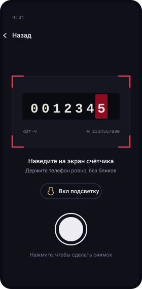

# Как развернуть этот сайт

Файл для ИТ-службы. Частью самого руководства не является — в боковое меню не входит и в поиск не попадает.

## Что это

Статический сайт на [docsify](https://docsify.js.org). Сборка не нужна: docsify собирает страницы в браузере из markdown-файлов. Достаточно отдать папку любым веб-сервером.

**Все зависимости лежат в `vendor/`** — docsify, плагины, шрифты Golos Text и JetBrains Mono. Сайт не обращается ни к каким внешним адресам, поэтому работает во внутренней сети без выхода в интернет.

## Размещение

<!-- Любой из вариантов; выбирайте тот, что ближе к вашей инфраструктуре. -->

### nginx

```nginx
server {
    listen 80;
    server_name docs.mosoblenergo.ru;
    root /var/www/meter-parser-docs;
    index index.html;

    location / {
        try_files $uri $uri/ /index.html;
    }
}
```

### Apache

Скопируйте папку в `DocumentRoot`. Дополнительная настройка не требуется — маршрутизация у docsify идёт через хеш в адресе, переписывание URL не нужно.

### IIS

Скопируйте папку в каталог сайта. Убедитесь, что для `.md` и `.woff2` заданы MIME-типы `text/markdown` и `font/woff2`, иначе IIS вернёт 404 на эти файлы.

### GitHub Pages и подобные

Положите содержимое папки в корень ветки. Файл `.nojekyll` уже на месте — без него Jekyll пропустит каталоги, начинающиеся с подчёркивания.

## Локальная проверка

Открыть `index.html` двойным щелчком не получится: docsify подгружает markdown запросами, а браузер блокирует их для протокола `file://`. Нужен любой локальный сервер:

```bash
python3 -m http.server 8080
# затем http://localhost:8080
```

## Структура

```
.
├── index.html              настройка docsify и подключение плагинов
├── sidebar.md              боковое меню
├── README.md               главная страница
├── DEPLOY.md               этот файл
├── .nojekyll
├── guide/                  разделы «Начало» и «Работа на обходе»
├── reference/              справочник и страница 404
├── it/                     разделы для ИТ-службы
├── assets/
│   ├── style.css           тема сайта целиком
│   ├── favicon.svg
│   └── screens/            схемы экранов приложения
│       ├── *.svg
│       └── _build.py       генератор схем
└── vendor/                 docsify, плагины и шрифты
```

## Как править содержимое

Страницы — обычный markdown. После правки файла обновите страницу в браузере, пересборка не нужна.

**Добавить страницу:** создайте `.md`-файл и впишите ссылку на него в `sidebar.md`. Ссылки в меню и внутри страниц пишутся от корня сайта (`reference/fields.md`), а не относительно текущего файла — за это отвечает `relativePath: false` в `index.html`.

**Изменить внешний вид:** всё в `assets/style.css`. Цвета, шрифты и размеры собраны в переменных в начале файла; тёмная тема переопределяет их ниже, в блоке media-запроса и в `:root[data-theme='dark']`.

**Перерисовать схемы экранов:** отредактируйте `assets/screens/_build.py` и запустите его — он перезапишет SVG-файлы. Нужен только Python 3, сторонних библиотек нет.

### Готовые фрагменты разметки

Надпись из приложения:

```html
<span class="ui">Внести показание</span>
```

Выноска (плагин flexible-alerts, подписи заданы в `index.html`):

```markdown
> [!TIP]
> Текст совета.
```

Доступны `[!NOTE]` — «Памятка», `[!TIP]` — «Совет», `[!WARNING]` — «Внимание», `[!ATTENTION]` — «Важно».

Вкладки:

```markdown
<!-- tabs:start -->
#### **Android 8 и новее**
Текст.
#### **Android 7**
Текст.
<!-- tabs:end -->
```

Пронумерованные шаги:

```html
<div class="steps">
<div class="step">

### Заголовок шага

Текст шага.

</div>
</div>
```

Схема экрана рядом с текстом:

```html
<div class="pair">

<div>

Текст справа от схемы.

</div>
</div>
```

## Подключённые плагины

| Плагин | Что даёт |
|---|---|
| `docsify-search` | Полнотекстовый поиск в боковом меню |
| `docsify-copy-code` | Кнопка «Копировать» у блоков кода |
| `docsify-pagination` | Переходы «Назад» и «Дальше» внизу страниц |
| `docsify-tabs` | Вкладки внутри страниц |
| `docsify-plugin-flexible-alerts` | Выноски с русскими подписями |
| `prismjs` | Подсветка JSON, bash и HTTP |

Плюс пять небольших плагинов, написанных прямо в `index.html`: марка в шапке меню, переключатель светлой и тёмной темы, чистка подсказок поиска от обрывков разметки, горизонтальная прокрутка таблиц на узких экранах и надзаголовок раздела над заголовком страницы.

## Обновление зависимостей

Содержимое `vendor/` собрано из npm-пакетов `docsify`, `docsify-copy-code`, `docsify-pagination`, `docsify-tabs`, `docsify-plugin-flexible-alerts`, `prismjs`, `@fontsource/golos-text` и `@fontsource/jetbrains-mono`. Чтобы обновить, скачайте новые версии и замените файлы в `vendor/`, сохранив имена.

## Откуда взято содержимое

Все тексты приложения, названия экранов, подсказки полей, сообщения об ошибках и адреса API приведены по сборке `MeterParser-v1_0_0.apk`: разобраны манифест, ресурсы и строковая таблица JS-бандла Hermes.

Структура тел запросов и ответов API в разделе «API бэкенда» — реконструкция по именам полей, которые использует приложение. Пути и методы точны; схемы ответов и коды ошибок стоит сверить с документацией бэкенда.

При выходе новой версии приложения обновите: номер версии в `index.html` (блок `sidebar-footer`), таблицу «Состав сборки» в `it/architecture.md` и тексты сообщений в `reference/errors.md`, если они изменились.
