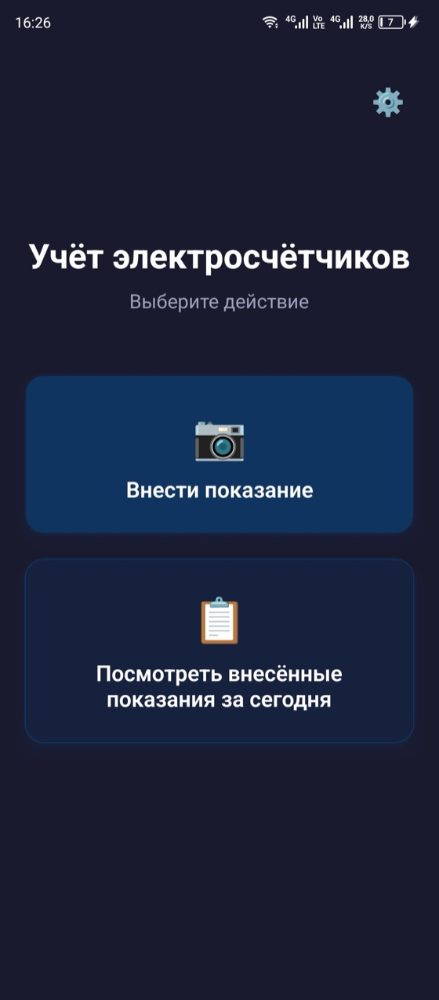
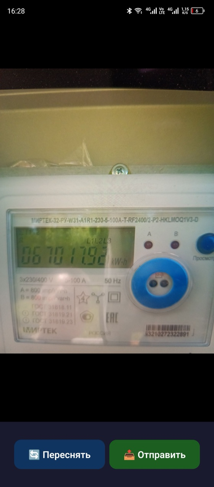
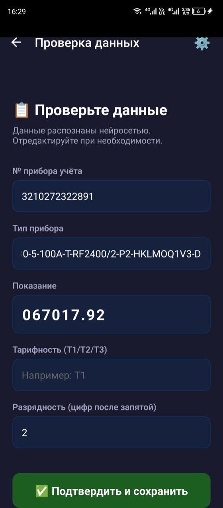
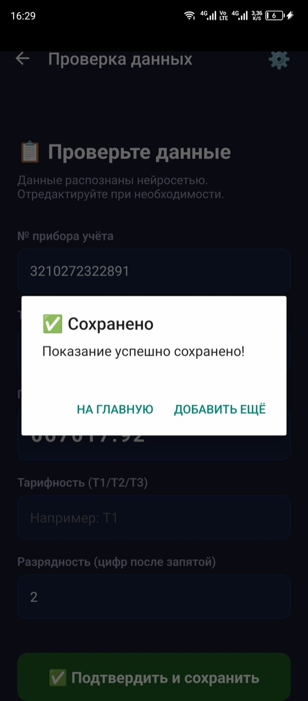
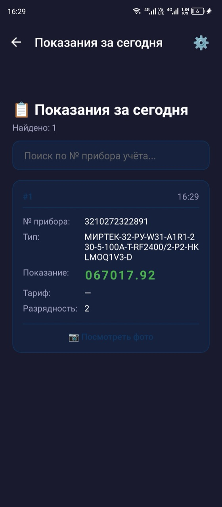

  

    
0

    
0

    
1

    
2

    
3

    
4

    
5

  

  
<b>001234,5 кВт·ч</b>

# Учёт электросчётчиков

**Meter Parser** — мобильное приложение для снятия показаний приборов учёта электроэнергии. Вы фотографируете счётчик, приложение распознаёт показания, вы проверяете данные и отправляете их на сервер.

| | |
|---|---|
| Версия | 1.0.0 |
| Платформа | Android 7.0 и новее |
| Нужно | Камера и связь с сервером |

На главном экране — два действия: сфотографировать новый счётчик или посмотреть, что уже отправлено сегодня. Шестерёнка справа вверху — [адрес сервера](guide/first-run.md).

## Снятие показаний

### Сфотографировать

Внести показание → навести камерой на прибор учета ЭЭ → сделать фото. Включите вспышку в приложении при плохом освещении.

### Отправить

Фото обрабатывается на сервере. 

### Дождаться распознавания

Номер прибора, показание, тарифность и тип подставятся в поля.
Сверьте поля с прибором учета ЭЭ, ошибки исправьте вручную в приложении.

### Проверить
Потведрдить и сохранить — показания в базе

<figure class="screen">

<figcaption><b>Снимок</b> Кадр смазан или бликует — переснимите.</figcaption>
</figure>
<figure class="screen">

<figcaption><b>Проверка</b> Поля уже заполнены, их можно править.</figcaption>
</figure>
<figure class="screen">

<figcaption><b>Готово</b> Показание сохранено на сервере.</figcaption>
</figure>

> [!TIP]
> Показание может распознаться некорректно. Перед отправкой сверьтесь с показаниями прибора учета ЭЭ - при необходимости отредактируйте поля вручную.

## Показания за сегодня

Посмотреть внесённые показания за сегодня на главном экране открывает список того, что вы уже отправили. Есть поиск по номеру прибора учёта и ссылка на фото каждого показания.

